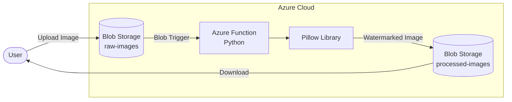

```mermaid
flowchart LR

    USER([User])

    USER -->|Upload Image| RAW[(Blob Storage<br/>raw-images)]

    RAW -->|Blob Trigger| FUNC[Azure Function<br/>Python]

    FUNC --> PIL[Pillow Library]

    PIL -->|Watermarked Image| OUT[(Blob Storage<br/>processed-images)]

    OUT -->|Download| USER

    subgraph Azure["Azure Cloud"]
        RAW
        FUNC
        PIL
        OUT
    end
```
