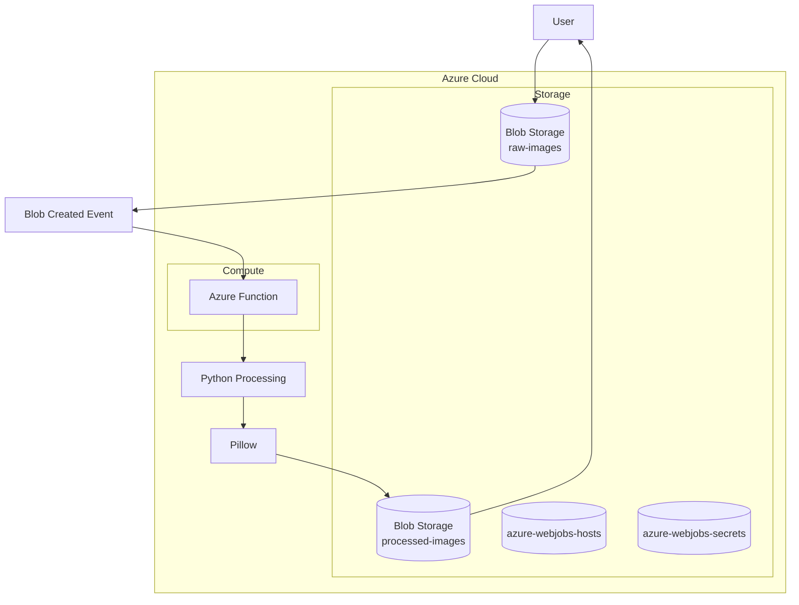

```mermaid
flowchart TD

    USER[User]

    USER --> RAW[(Blob Storage<br/>raw-images)]

    RAW --> EVENT[Blob Created Event]

    EVENT --> FUNC[Azure Function]

    FUNC --> CODE[Python Processing]

    CODE --> PIL[Pillow]

    PIL --> OUT[(Blob Storage<br/>processed-images)]

    OUT --> USER

    subgraph Azure["Azure Cloud"]

        subgraph Storage
            RAW
            OUT
            HOSTS[(azure-webjobs-hosts)]
            SECRETS[(azure-webjobs-secrets)]
        end

        subgraph Compute
            FUNC
        end

        CODE
        PIL
    end
```
