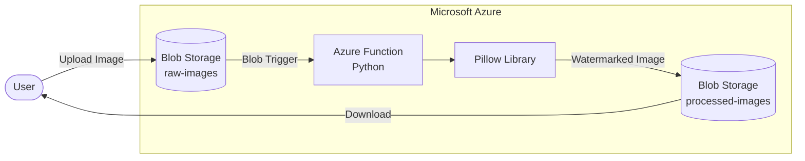

# Cloud Image Processing using Azure Functions

## Overview

Cloud Image Processing is a serverless image processing application built using **Microsoft Azure** and **Python**. The application automatically adds a watermark to images uploaded by users. Whenever an image is uploaded to an Azure Blob Storage container, an Azure Function is triggered automatically, processes the image using the Pillow library, and stores the processed image in another Blob Storage container.

This project demonstrates **event-driven architecture**, **serverless computing**, and **cloud automation** without managing any servers.

---

## Features

* Event-driven image processing
* Automatic Blob Trigger execution
* Serverless architecture using Azure Functions
* Watermark images using Python (Pillow)
* Separate containers for input and output images
* Fully automated processing pipeline
* Easy to extend for resizing, compression, OCR, or AI-based image processing

---

## Architecture



---

## Workflow

1. User uploads an image to the **raw-images** Blob Storage container.
2. Azure Blob Storage detects the upload.
3. A Blob Trigger automatically invokes the Azure Function.
4. The Azure Function reads the uploaded image.
5. Pillow processes the image by adding a watermark.
6. The processed image is uploaded to the **processed-images** Blob Storage container.
7. User downloads the processed image.

---

## Technologies Used

| Technology         | Purpose                 |
| ------------------ | ----------------------- |
| Microsoft Azure    | Cloud Platform          |
| Azure Functions    | Serverless Compute      |
| Azure Blob Storage | Image Storage           |
| Python             | Backend Logic           |
| Pillow (PIL)       | Image Processing        |
| Azure Storage SDK  | Upload/Download Images  |
| VS Code            | Development Environment |

---

## Project Structure

```text
cloudImageProcessor/
│
├── function_app.py              # Main Azure Function
├── host.json                    # Function runtime configuration
├── local.settings.json          # Local configuration
├── requirements.txt             # Python dependencies
├── .funcignore
├── .gitignore
│
├── images/
│   ├── architecture.png
│   ├── workflow.png
│   └── demo.png
│
└── README.md
```

---

## Azure Resources Used

* Resource Group
* Storage Account
* Blob Container (raw-images)
* Blob Container (processed-images)
* Azure Function App
* Azure Functions Runtime

---

## Setup Instructions

### 1. Clone the Repository

```bash
git clone https://github.com/<your-username>/cloud-image-processing.git

cd cloud-image-processing
```

---

### 2. Create Virtual Environment

```bash
python -m venv .venv
```

Activate the environment

**Windows**

```bash
.\.venv\Scripts\activate
```

---

### 3. Install Dependencies

```bash
pip install -r requirements.txt
```

---

### 4. Configure Azure Storage

Update `local.settings.json` with your Azure Storage connection string.

```json
{
  "IsEncrypted": false,
  "Values": {
    "AzureWebJobsStorage": "<Your Connection String>",
    "FUNCTIONS_WORKER_RUNTIME": "python"
  }
}
```

---

### 5. Run Locally

```bash
func start
```

---

## Folder Structure in Azure Storage

```text
Storage Account
│
├── raw-images
│
├── processed-images
│
├── azure-webjobs-hosts
│
└── azure-webjobs-secrets
```

---


---

## License

This project is licensed under the MIT License.
